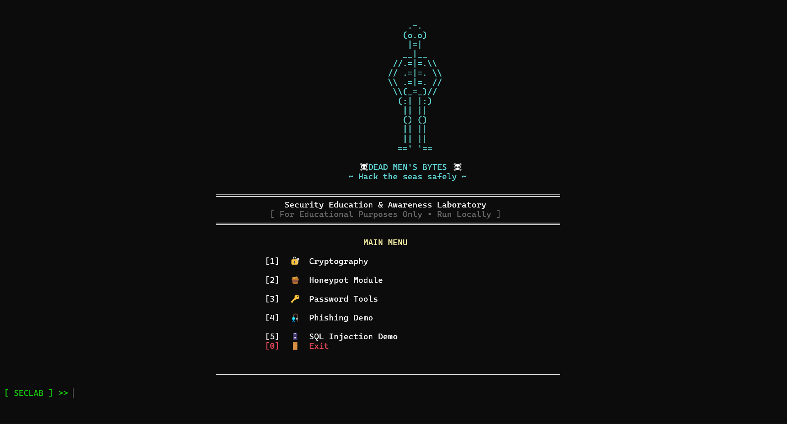

# 🛡️ SecLab Toolkit

## 📖 Introduction

**SecLab Toolkit (Security Labs Toolkit)** is a Python-based cybersecurity learning and simulation framework designed for students, beginners, and security enthusiasts.

The toolkit combines multiple cybersecurity concepts into a single command-line interface (CLI) platform to provide practical exposure to:

* Cryptography
* Password Security
* Honeypot Simulation
* Phishing Awareness
* SQL Injection Demonstrations
* Logging and Monitoring
* Ethical Hacking Concepts

The project focuses on hands-on learning through interactive demonstrations and simulated security environments. It is intended strictly for educational, research, and cybersecurity practice purposes.

---

# ✨ Features

* Modular cybersecurity toolkit
* Interactive CLI-based interface
* Cryptography demonstrations
* Password analysis and generation tools
* SSH honeypot simulation
* Security logging and monitoring
* Educational phishing demo
* SQL Injection practice environment
* Beginner-friendly implementation
* Real-world cybersecurity concepts

---

# ⚙️ Technologies Used

* Python
* Paramiko
* Socket Programming
* PyCryptodome
* OpenCV
* Logging
* Threading
* File Handling

---

# 📂 Project Structure

```bash id="ivxg9w"
SecLab-Toolkit/
│
├── cryptography/
│   ├── aes_demo.py
│   ├── rsa_demo.py
│   ├── digital_signature_demo.py
│   ├── secure_file_encryptor.py
│   ├── caesar_cipher.py
│   ├── vigenere_cipher.py
│   ├── base64_encoder_decoder.py
│   ├── hex_encoder_decoder.py
│   ├── url_encoder_decoder.py
│   ├── hash_generator.py
│   ├── hash_identifier.py
│   ├── file_hash_checker.py
│   └── Steganography.py
│
├── password_tools/
│   ├── generator.py
│   ├── strength.py
│   ├── password_entropy_calculator.py
│   ├── commonpassworddetector.py
│   └── attack_simulator.py
│
├── honeypot/
│   ├── honeypot.py
│   ├── audits.log
│   ├── cmd_audits.log
│   └── server_key
│
├── phishing_demo/
│
├── sql_injection_demo/
│
├── main.py
└── README.md
```

---

# 🚀 Installation

## 1. Clone the Repository

```bash id="4iwd0x"
git clone https://github.com/murariguna/SECLAB.git
cd SECLAB
```

---

## 2. Install Dependencies

```bash id="twjlwm"
pip install -r requirements.txt
```
---

# ▶️ Running the Project

Run the main toolkit interface:

```bash id="eq8ldg"
python main.py
```

You can also execute individual tools directly:

```bash id="g6j1pn"
python aes_demo.py
```

---

# 🧩 Main Modules

| Module               | Description                                                      |
| -------------------- | ---------------------------------------------------------------- |
| Cryptography         | Encryption, hashing, encoding, digital signatures, steganography |
| Password Security    | Password generation, entropy analysis, strength testing          |
| Honeypot             | SSH honeypot simulation and monitoring                           |
| Phishing Demo        | Educational phishing simulation                                  |
| SQL Injection Demo   | SQL Injection attack and prevention demo                         |
| Logging & Monitoring | Tracks activity and simulated attacks                            |

---

# 🔐 Cryptography Module

The Cryptography Module demonstrates both classical and modern cryptographic techniques including encryption, hashing, encoding, digital signatures, and steganography.

---

## 📜 Programs in the Cryptography Module

### 1. AES Encryption Demo

Demonstrates AES (Advanced Encryption Standard) symmetric encryption and decryption using CBC mode.

#### Features

* AES encryption
* AES decryption
* 16-character key validation
* CBC mode implementation

#### Use Cases

* Secure communication
* File protection
* Learning symmetric encryption

---

### 2. RSA Encryption Demo

Demonstrates RSA asymmetric encryption using public and private keys.

#### Features

* RSA key generation
* Public key encryption
* Private key decryption

#### Use Cases

* Secure key exchange
* Public-key cryptography learning
* Encryption demonstrations

---

### 3. Digital Signature Demo

Demonstrates how digital signatures work using RSA and SHA-256.

#### Features

* RSA key generation
* Message signing
* Signature verification
* SHA-256 hashing

#### Use Cases

* Digital signature learning
* Data authenticity verification
* Integrity checking

---

### 4. Secure File Encryptor

Encrypts and decrypts files securely using AES encryption.

#### Features

* File encryption
* File decryption
* AES-CBC encryption mode
* Secure file handling

#### Use Cases

* File protection
* Secure data storage
* Encryption practice

---

### 5. Caesar Cipher

Implements the classical Caesar substitution cipher.

#### Features

* Encode messages
* Decode messages
* Adjustable shift value

#### Use Cases

* Learning classical cryptography
* Cipher analysis practice

---

### 6. Vigenère Cipher

Implements the Vigenère polyalphabetic cipher using keyword-based encryption.

#### Features

* Keyword-based encryption
* Encoding and decoding support

#### Use Cases

* Classical cryptography learning
* Encryption analysis

---

### 7. Base64 Encoder/Decoder

Encodes and decodes Base64 text data.

#### Features

* Base64 encoding
* Base64 decoding

#### Use Cases

* Data transmission
* Encoding binary data into text

---

### 8. Hex Encoder/Decoder

Encodes and decodes hexadecimal strings.

#### Features

* Hex encoding
* Hex decoding

#### Use Cases

* Binary analysis
* Low-level data representation

---

### 9. URL Encoder/Decoder

Performs URL-safe encoding and decoding.

#### Features

* URL encoding
* URL decoding

#### Use Cases

* Web application testing
* HTTP request analysis

---

### 10. Hash Generator

Generates SHA-256 hashes for passwords or text.

#### Features

* SHA-256 hashing

#### Use Cases

* Password hashing
* Integrity verification

---

### 11. Hash Identifier

Identifies common hash algorithms based on pattern and length.

#### Features

* MD5 detection
* SHA-1 detection
* SHA-256 detection
* SHA-512 detection

#### Use Cases

* Hash analysis
* Digital forensics learning

---

### 12. File Hash Checker

Calculates hashes of files for integrity verification.

#### Features

* MD5 hashing
* SHA-1 hashing
* SHA-256 hashing

#### Use Cases

* File integrity checking
* Malware analysis
* Digital forensics

---

### 13. Steganography Tool

Hides secret messages inside images using LSB (Least Significant Bit) steganography.

#### Features

* Message hiding in images
* Password-protected retrieval
* LSB encoding technique

#### Use Cases

* Covert communication
* Steganography learning
* Cybersecurity demonstrations

---

# 🔑 Password Security Module

The Password Security Module focuses on password generation, password auditing, strength analysis, and password attack simulations.

---

## 📜 Programs in the Password Security Module

### 1. Password Generator

Generates secure random passwords based on user preferences.

#### Features

* Custom password generation
* Random password generation
* Configurable character sets

#### Use Cases

* Secure password creation
* Password management practice

---

### 2. Password Strength Checker

Analyzes password complexity and determines its security level.

#### Features

* Weak/Moderate/Strong classification
* Common password detection

#### Use Cases

* Password auditing
* Security awareness training

---

### 3. Password Entropy Calculator

Calculates password entropy in bits.

#### Features

* Entropy calculation
* Character set analysis

#### Use Cases

* Password security measurement
* Cryptography education

---

### 4. Common Password Detector

Checks whether a password exists in a common-password dictionary.

#### Features

* Dictionary-based password analysis

#### Use Cases

* Weak password detection
* Security awareness

---

### 5. Password Attack Simulator

Simulates password guessing and brute-force behavior for educational purposes.

#### Features

* Password guessing simulation
* Randomized attack attempts
* Demonstrates brute-force principles

#### Use Cases

* Ethical hacking demonstrations
* Password security awareness
* Cybersecurity education

---

# 🍯 Honeypot Module

The Honeypot Module simulates an SSH server to monitor and log attacker activity.

---

## 📜 SSH Honeypot

A simulated SSH server that records login attempts and commands executed by attackers.

### Features

* SSH server emulation
* Fake shell environment
* Credential logging
* Command logging
* Real-time monitoring
* Rotating audit logs

### Logged Information

* IP addresses
* Usernames
* Password attempts
* Executed commands

### Generated Files

* `audits.log`
* `cmd_audits.log`
* `server_key`

### Supported Commands

* `pwd`
* `whoami`
* `ls`
* `cat jumpbox1.conf`
* `exit`

### Use Cases

* Threat monitoring
* Attack analysis
* Cybersecurity education
* Honeypot research

---

# 🎣 Phishing Awareness Demo

The Phishing Awareness Module demonstrates how phishing websites trick users into revealing sensitive information.

---

## ✨ Features

* Fake login page simulation
* Credential capture demonstration
* Awareness-based learning
* Social engineering simulation
* Educational warning messages

---

## 💡 Use Cases

* Cybersecurity awareness training
* Social engineering demonstrations
* Phishing attack education
* Ethical hacking demonstrations

---

# 💉 SQL Injection Demo

The SQL Injection Demo demonstrates how insecure database queries can be exploited and how secure coding practices prevent attacks.

---

## ✨ Features

* Vulnerable login simulation
* SQL Injection payload testing
* Authentication bypass demonstration
* Secure query comparison
* Input sanitization examples

---

## 💡 Use Cases

* Web security education
* Secure coding demonstrations
* Ethical hacking practice
* Vulnerability analysis learning

---

# 📊 Logging and Monitoring

The toolkit includes logging systems to monitor simulated activity and attacker behavior.

---

## 📁 Log Files

| File           | Purpose                      |
| -------------- | ---------------------------- |
| audits.log     | Connection and activity logs |
| cmd_audits.log | Command execution logs       |

---

# ⚠️ Educational Purpose Notice

This toolkit is created strictly for:

* Educational purposes
* Ethical hacking practice
* Cybersecurity learning
* Security research
* Demonstration environments

Do not use this toolkit against systems you do not own or have permission to test.

---

# 🔮 Future Improvements

* GUI-based interface
* Web dashboard
* Network scanner integration
* Packet sniffer module
* Malware analysis sandbox
* Advanced logging dashboard
* AI-assisted threat analysis
* Multi-user support

---

# 👨‍💻 Author

Developed by Satya Murari Guna

---

<p align="center">  </p>

---

# 📜 License

This project is intended for educational and research purposes only.

Use responsibly and ethically.
